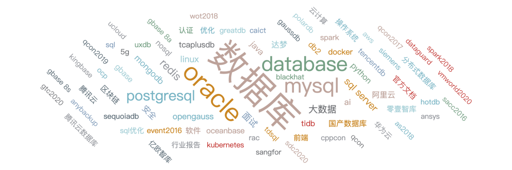
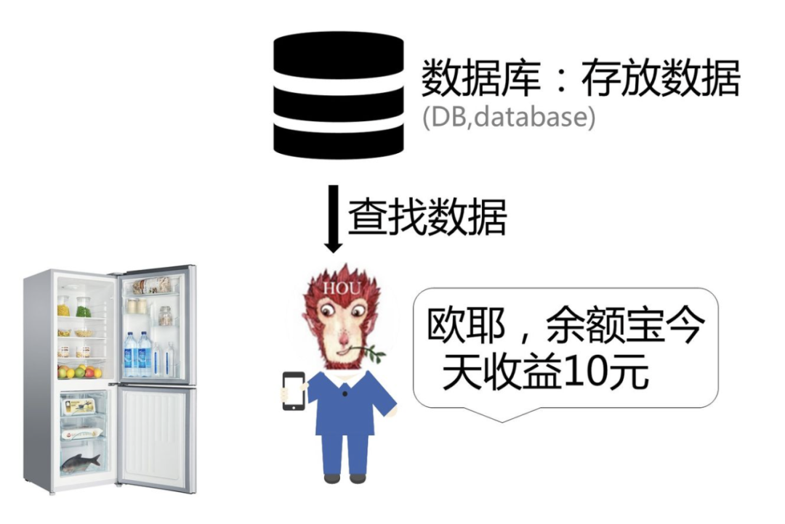

### 第一章 SQL 介绍

**1. 什么是 SQL**

SQL 是用于访问和处理数据库的标准的计算机语言
-   SQL 指结构化查询语言
-   SQL 使我们有能力访问数据库
-   SQL 是一种 ANSI 的标准计算机语言

SQL 可与数据库程序协同工作，比如 MS Access、DB2、Informix、MS SQL Server、Oracle、Sybase 以及其他数据库系统

但是由于各种各样的数据库出现，导致很多不同版本的 SQL 语言。

为了与 ANSI 标准相兼容，它们必须以相似的方式共同地来支持一些主要的关键词（比如 SELECT、UPDATE、DELETE、INSERT、WHERE 等等），这些就是我们要学习的SQL基础。

**2. SQL 的类型**

可以把 SQL 分为两个部分：数据操作语言 (DML) 和 数据定义语言 (DDL)。
-   数据查询语言（DQL: Data Query Language）
-   数据操纵语言（DML：Data Manipulation Language）

**3. 学习 SQL 的作用**

SQL 是一门 ANSI 的标准计算机语言，用来访问和操作数据库系统。SQL 语句用于取回和更新数据库中的数据。
-   SQL 面向数据库执行查询
-   SQL 可从数据库取回数据
-   SQL 可在数据库中插入新的记录
-   SQL 可更新数据库中的数据
-   SQL 可从数据库删除记录
-   SQL 可创建新数据库
-   SQL 可在数据库中创建新表
-   SQL 可在数据库中创建存储过程
-   SQL 可在数据库中创建视图
-   SQL 可以设置表、存储过程和视图的权限

**4. 数据库是什么**

**顾名思义，你可以理解为数据库是用来存放数据的一个容器。**

打个比方，每个人家里都会有冰箱，冰箱是用来干什么的？冰箱是用来存放食物的地方。

同样的，数据库是存放数据的地方。正是因为有了数据库后，我们可以直接查找数据。

例如你每天使用余额宝查看自己的账户收益，就是从数据库读取数据后给你的。

**最常见的数据库类型是关系型数据库管理系统（RDBMS）：**

RDBMS 是 SQL 的基础，同样也是所有现代数据库系统的基础，比如：
-   MS SQL Server
-   IBM DB2
-   Oracle
-   MySQL
-   Microsoft Access

**RDBMS** 中的数据存储在被称为表（tables）的数据库对象中。**表** 是相关的数据项的集合，它由列和行组成。