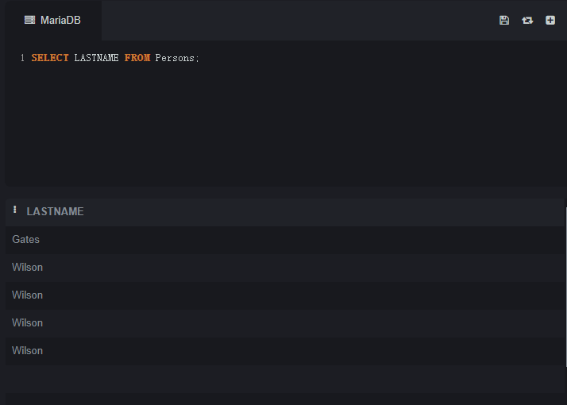
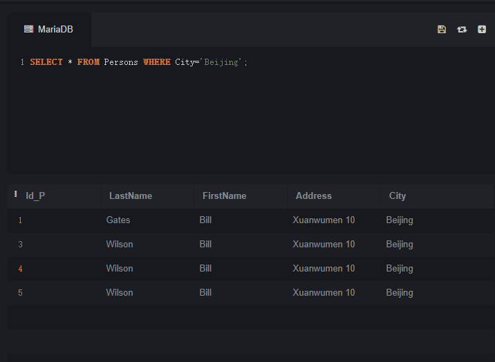

### 第二章 SQL 基础操作

**SQL 基础语言学习**

在了解 SQL 基础语句使用之前，我们先讲一下 **表** 是什么？

一个数据库通常包含一个或多个表。每个表由一个名字标识（例如“客户”或者“订单”）。表包含带有数据的记录(行)。

**下面的例子是一个名为 “Persons” 的表：**

| **Id** | **LastName** | **FirstName** | **Address** | **City** |
| --- | --- | --- | --- | --- |
| 1 | Adams | John | Oxford Street | London |
| 2 | Bush | George | Fifth Avenue | New York |
| 3 | Carter | Thomas | Changan Street | Beijing |

上面的表包含三条记录（每一条对应一个人）和五个列（Id、姓、名、地址和城市）。

**有表才能查询，那么如何创建这样一个表？**

**1. CREATE TABLE – 创建表**

CREATE TABLE 语句用于创建数据库中的表。

**语法：**

```sql
CREATE TABLE 表名称 ( 列名称1 数据类型, 列名称2 数据类型, 列名称3 数据类型, .... );
```

数据类型（data_type）规定了列可容纳何种数据类型。下面的表格包含了SQL中最常用的数据类型：

| **数据类型** | **描述** |
| --- | --- |
| integer(size),int(size),smallint(size),tinyint(size) | 仅容纳整数、在括号内规定数字的最大位数 |
| decimal(size,d),numeric(size,d) | 容纳带有小数的数字、“size” 规定数字的最大位数、“d” 规定小数点右侧的最大位数 |
| char(size) | 容纳固定长度的字符串（可容纳字母、数字以及特殊字符）、在括号中规定字符串的长度 |
| varchar(size) | 容纳可变长度的字符串（可容纳字母、数字以及特殊的字符）、在括号中规定字符串的最大长度 |
| date(yyyymmdd) | 容纳日期 |

**例子：**

本例演示如何创建名为 “Persons” 的表。

该表包含 5 个列，列名分别是：“Id_P”、“LastName”、“FirstName”、“Address” 以及 “City”：

```sql
CREATE TABLE Persons ( Id_P int, LastName varchar(255), FirstName varchar(255), Address varchar(255), City varchar(255) );
```

Id_P 列的数据类型是 int，包含整数。其余 4 列的数据类型是 varchar，最大长度为 255 个字符。

**空的 “Persons” 表类似这样：**

| **Id_P** | **LastName** |**FirstName** |**Address** |**City** |
| --- | --- |
|  |  |  |  |  |  |

可使用 INSERT INTO 语句向空表写入数据。

**2. INSERT – 插入数据**

INSERT INTO 语句用于向表格中插入新的行。

**语法：**

```sql
INSERT INTO 表名称 VALUES (值1, 值2,....); 我们也可以指定所要插入数据的列： INSERT INTO table_name (列1, 列2,...) VALUES (值1, 值2,....);
```

**例子：**

本例演示 “Persons” 表插入记录的两种方式：

**1）插入新的行**

```sql
INSERT INTO Persons VALUES (1, 'Gates', 'Bill', 'Xuanwumen 10', 'Beijing');
```

**2）在指定的列中插入数据**

```sql
INSERT INTO Persons (LastName, Address) VALUES ('Wilson', 'Champs-Elysees');
```

**插入成功后，数据如下：**


这个数据插入之后，是通过 SELECT 语句进行查询出来的，后续会讲！

**3. SELECT – 查询数据**

SELECT 语句用于从表中选取数据，结果被存储在一个结果表中（称为结果集）。

**语法：**

```sql
SELECT * FROM 表名称;
```

我们也可以指定所要查询数据的列：

```sql
SELECT 列名称 FROM 表名称;
```

**注意：**

SQL 语句对大小写不敏感，SELECT 等效于 select。

**实例：**

**SQL SELECT * 实例：**

```sql
SELECT * FROM Persons;
```


**注意：**

星号（*）是选取所有列的快捷方式。

如需获取名为 “LastName” 和 “FirstName” 的列的内容（从名为 “Persons” 的数据库表），请使用类似这样的 SELECT 语句：

```sql
SELECT LastName,FirstName FROM Persons;
```


### **4. DISTINCT – 去除重复值**

如果一张表中有多行重复数据，如何去重显示呢？可以了解下 **DISTINCT** 。

**语法：**

```sql
SELECT DISTINCT 列名称 FROM 表名称;
```

**实例：**

如果要从 “LASTNAME” 列中选取所有的值，我们需要使用 **SELECT** 语句：

先构造数据：

```sql
INSERT INTO Persons VALUES (3, 'Wilson', 'Bill', 'Xuanwumen 10', 'Beijing');
INSERT INTO Persons VALUES (4, 'Wilson', 'Bill', 'Xuanwumen 10', 'Beijing');
INSERT INTO Persons VALUES (5, 'Wilson', 'Bill', 'Xuanwumen 10', 'Beijing');
```

```sql
SELECT LASTNAME FROM Persons;
```



可以发现，在结果集中，Wilson 被列出了多次。

如需从 “LASTNAME” 列中仅选取唯一不同的值，我们需要使用 SELECT DISTINCT 语句：

```sql
SELECT DISTINCT LASTNAME FROM Persons;
```


通过上述查询，结果集中只显示了一列 Wilson，显然已经去除了重复列。

### **5. WHERE – 条件过滤**

如果需要从表中选取指定的数据，可将 WHERE 子句添加到 SELECT 语句。

**语法：**

```sql
SELECT 列名称 FROM 表名称 WHERE 列 运算符 值;
```

下面的运算符可在 WHERE 子句中使用：

| **操作符** | **描述** |
| -- | --- |
| = | 等于 |
| <> | 不等于 |
| > | 大于 |
| < | 小于 |
| >= | 大于等于 |
| <= | 小于等于 |
| BETWEEN | 在某个范围内 |
| LIKE | 搜索某种模式 |

**注意：**

在某些版本的 SQL 中，操作符 <> 可以写为 !=。

**实例：**

如果只希望选取居住在城市 “Beijing” 中的人，我们需要向 SELECT 语句添加 WHERE 子句：

```sql
SELECT * FROM Persons WHERE City='Beijing';
```



**注意：**

SQL 使用单引号来环绕文本值（大部分数据库系统也接受双引号）。如果是数值，请不要使用引号。

### **6. AND & OR – 运算符**

AND 和 OR 可在 WHERE 子语句中把两个或多个条件结合起来。

-   如果第一个条件和第二个条件都成立，则 AND 运算符显示一条记录。

-   如果第一个条件和第二个条件中只要有一个成立，则 OR 运算符显示一条记录。


**语法：**

**AND 运算符实例：**

```sql
SELECT * FROM 表名称 WHERE 列 运算符 值 AND 列 运算符 值;
```

**OR 运算符实例：**

```sql
SELECT * FROM 表名称 WHERE 列 运算符 值 OR 列 运算符 值;
```

**实例：**

由于 Persons 表数据太少，因此增加几条记录：

```sql
INSERT INTO Persons VALUES (2, 'Adams', 'John', 'Oxford Street', 'London'); INSERT INTO Persons VALUES (3, 'Bush', 'George', 'Fifth Avenue', 'New York'); INSERT INTO Persons VALUES (4, 'Carter', 'Thomas', 'Changan Street', 'Beijing'); INSERT INTO Persons VALUES (5, 'Carter', 'William', 'Xuanwumen 10', 'Beijing'); SELECT * FROM Persons;
```


**AND 运算符实例：**

使用 AND 来显示所有姓为 “Carter” 并且名为 “Thomas” 的人：

```sql
SELECT * FROM Persons WHERE FirstName='Thomas' AND LastName='Carter';
```


**OR 运算符实例：**

使用 OR 来显示所有姓为 “Carter” 或者名为 “Thomas” 的人：

```sql
SELECT * FROM Persons WHERE firstname='Thomas' OR lastname='Carter';
```


**结合 AND 和 OR 运算符：**

我们也可以把 AND 和 OR 结合起来（使用圆括号来组成复杂的表达式）:

```sql
SELECT * FROM Persons WHERE (FirstName='Thomas' OR FirstName='William') AND LastName='Carter';
```


### **7. ORDER BY – 排序**

ORDER BY 语句用于根据指定的列对结果集进行排序，默认按照升序对记录进行排序，如果您希望按照降序对记录进行排序，可以使用 DESC 关键字。

**语法：**

```sql
SELECT * FROM 表名称 ORDER BY 列1,列2 DESC;
```

默认排序为 ASC 升序，DESC 代表降序。

**实例：**

以字母顺序显示 **LASTNAME** 名称：

```sql
SELECT * FROM Persons ORDER BY LASTNAME;
```


空值（NULL）默认排序在有值行之后。

以数字顺序显示**ID_P**，并以字母顺序显示 **LASTNAME** 名称：

```sql
SELECT * FROM Persons ORDER BY ID_P,LASTNAME;
```


以数字降序显示**ID_P**：

```sql
SELECT * FROM Persons ORDER BY ID_P DESC;
```


**注意：**

在第一列中有相同的值时，第二列是以升序排列的。如果第一列中有些值为 null 时，情况也是这样的。同理 desc 降序，asc 升序

### **8. UPDATE – 更新数据**

Update 语句用于修改表中的数据。

**语法：**

```sql
UPDATE 表名称 SET 列名称 = 新值 WHERE 列名称 = 某值;
```

**实例：**

**更新某一行中的一个列：**

目前 **Persons** 表有很多字段为 **null** 的数据，可以通过 **UPDATE** 为 LASTNAME 是 “Wilson” 的人添加FIRSTNAME：

```sql
UPDATE Persons SET FirstName = 'Fred' WHERE LastName = 'Wilson';
```

**更新某一行中的若干列：**

```sql
UPDATE Persons SET ID_P = 6,city= 'London' WHERE LastName = 'Wilson';
```

最后我们可以通过 select 查询数据

### **9. DELETE – 删除数据**

DELETE 语句用于删除表中的行。

**语法：**

```sql
DELETE FROM 表名称 WHERE 列名称 = 值;
```

**实例：**

**删除某行：**

删除 **Persons** 表中 LastName 为 “Fred Wilson” 的行：

```sql
DELETE FROM Persons WHERE LastName = 'Wilson';
```

**删除所有行：**

可以在不删除表的情况下删除所有的行。这意味着表的结构、属性和索引都是完整的：

```sql
DELETE FROM table_name;
```

### **10. TRUNCATE TABLE – 清除表数据**

如果我们仅仅需要除去表内的数据，但并不删除表本身，那么我们该如何做呢？

可以使用 TRUNCATE TABLE 命令（仅仅删除表格中的数据）：

**语法：**

```sql
TRUNCATE TABLE 表名称;
```

**实例：**

本例演示如何删除名为 “Persons” 的表。

```sql
TRUNCATE TABLE persons;
```

### **11. DROP TABLE – 删除表**

DROP TABLE 语句用于删除表（表的结构、属性以及索引也会被删除）。

**语法：**

```sql
DROP TABLE 表名称;
```

**实例：**

本例演示如何删除名为 “Persons” 的表。

```sql
drop table persons;
```

从上图可以看出，第一次执行删除时，成功删除了表 **persons**，第二次执行删除时，报错找不到表 **persons**，说明表已经被删除了。

## **03 SQL 高级言语学习**

### **1. LIKE – 查找类似值**

LIKE 操作符用于在 WHERE 子句中搜索列中的指定模式。

**语法：**

```sql
SELECT 列名/(*) FROM 表名称 WHERE 列名称 LIKE 值;
```

**实例：**

**Persons** 表插入数据：

```sql
INSERT INTO Persons VALUES (1, 'Gates', 'Bill', 'Xuanwumen 10', 'Beijing'); INSERT INTO Persons VALUES (2, 'Adams', 'John', 'Oxford Street', 'London'); INSERT INTO Persons VALUES (3, 'Bush', 'George', 'Fifth Avenue', 'New York'); INSERT INTO Persons VALUES (4, 'Carter', 'Thomas', 'Changan Street', 'Beijing'); INSERT INTO Persons VALUES (5, 'Carter', 'William', 'Xuanwumen 10', 'Beijing'); select * from persons;
```

1）现在，我们希望从上面的 “Persons” 表中选取居住在以 “N” 开头的城市里的人：

```sql
SELECT * FROM Persons WHERE City LIKE 'N%';
```

2）接下来，我们希望从 “Persons” 表中选取居住在以 “g” 结尾的城市里的人：

```sql
SELECT * FROM Persons WHERE City LIKE '%g';
```

3）接下来，我们希望从 “Persons” 表中选取居住在包含 “lon” 的城市里的人：

```sql
SELECT * FROM Persons WHERE City LIKE '%on%';
```

4）通过使用 NOT 关键字，我们可以从 “Persons” 表中选取居住在不包含 “lon” 的城市里的人：

```sql
SELECT * FROM Persons WHERE City NOT LIKE '%on%';
```

**注意：**

“%” 可用于定义通配符（模式中缺少的字母）。

### **2. IN – 锁定多个值**

IN 操作符允许我们在 WHERE 子句中规定多个值。

**语法：**

```sql
SELECT 列名(*) FROM 表名称 WHERE 列名称 IN (值1,值2,值3);
```

**实例：**

现在，我们希望从 **Persons** 表中选取姓氏为 Adams 和 Carter 的人：

```sql
SELECT * FROM Persons WHERE LastName IN ('Adams','Carter');
```

### **3. BETWEEN – 选取区间数据**

操作符 BETWEEN … AND 会选取介于两个值之间的数据范围。这些值可以是数值、文本或者日期。

**语法：**

```sql
SELECT 列名(*) FROM 表名称 WHERE 列名称 BETWEEN 值1 AND 值2;
```

**实例：**

1）查询以字母顺序显示介于 “Adams”（包括）和 “Carter”（不包括）之间的人：

```sql
SELECT * FROM Persons WHERE LastName BETWEEN 'Adams' AND 'Carter';
```

2）查询上述结果相反的结果，可以使用 NOT：

```sql
SELECT * FROM Persons WHERE LastName NOT BETWEEN 'Adams' AND 'Carter';
```

**注** **意：**

不同的数据库对 BETWEEN…AND 操作符的处理方式是有差异的。

> 某些数据库会列出介于 “Adams” 和 “Carter” 之间的人，但不包括 “Adams” 和 “Carter” ；某些数据库会列出介于 “Adams” 和 “Carter” 之间并包括 “Adams” 和 “Carter” 的人；而另一些数据库会列出介于 “Adams” 和 “Carter” 之间的人，包括 “Adams” ，但不包括 “Carter” 。

**所以，请检查你的数据库是如何处理 BETWEEN…AND 操作符的！**

### **4. AS – 别名**

通过使用 SQL，可以为列名称和表名称指定别名（Alias），别名使查询程序更易阅读和书写。

**语法：**

**表别名：**

```sql
SELECT 列名称(*) FROM 表名称 AS 别名;
```

**列别名：**

```sql
SELECT 列名称 as 别名 FROM 表名称;
```

**实例：**

**使用表名称别名：**

```sql
SELECT p.LastName, p.FirstName FROM Persons p WHERE p.LastName='Adams' AND p.FirstName='John';
```

**使用列名别名：**

```sql
SELECT LastName "Family", FirstName "Name" FROM Persons;
```

**注意：**

实际应用时，这个 **AS** 可以省略，但是列别名需要加上 **" "**。

### **5. JOIN – 多表关联**

**JOIN** 用于根据两个或多个表中的列之间的关系，从这些表中查询数据。

有时为了得到完整的结果，我们需要从两个或更多的表中获取结果。我们就需要执行 **join**。

数据库中的表可通过键将彼此联系起来。主键（Primary Key）是一个列，在这个列中的每一行的值都是唯一的。在表中，每个主键的值都是唯一的。这样做的目的是在不重复每个表中的所有数据的情况下，把表间的数据交叉捆绑在一起。

如图，“Id_P” 列是 Persons 表中的的主键。这意味着没有两行能够拥有相同的 Id_P。即使两个人的姓名完全相同，Id_P 也可以区分他们。

**为了下面实验的继续，我们需要再创建一个表：Orders。**

```sql
create table orders (id_o number,orderno number,id_p number); insert into orders values(1,11111,1); insert into orders values(2,22222,2); insert into orders values(3,33333,3); insert into orders values(4,44444,4); insert into orders values(6,66666,6); select * from orders;
```

如图，“Id_O” 列是 Orders 表中的的主键，同时，“Orders” 表中的 “Id_P” 列用于引用 “Persons” 表中的人，而无需使用他们的确切姓名。

```sql
select * from persons p,orders o where p.id_p=o.id_p;
```

可以看到，“Id_P” 列把上面的两个表联系了起来。

**语法：**

```sql
select 列名 from 表A INNER|LEFT|RIGHT|FULL JOIN 表B ON 表A主键列 = 表B外键列;
```

**不同的 SQL JOIN：**

下面列出了您可以使用的 JOIN 类型，以及它们之间的差异。

-   JOIN: 如果表中有至少一个匹配，则返回行
-   INNER JOIN: 内部连接，返回两表中匹配的行
-   LEFT JOIN: 即使右表中没有匹配，也从左表返回所有的行
-   RIGHT JOIN: 即使左表中没有匹配，也从右表返回所有的行
-   FULL JOIN: 只要其中一个表中存在匹配，就返回行


**实例：**

如果我们希望列出所有人的定购，可以使用下面的 SELECT 语句：

```sql
SELECT p.LastName, p.FirstName, o.OrderNo FROM Persons p INNER JOIN Orders o ON p.Id_P = o.Id_P ORDER BY p.LastName DESC;
```

### **6. UNION – 合并结果集**

UNION 操作符用于合并两个或多个 SELECT 语句的结果集。

**UNION 语法：**

```sql
SELECT 列名 FROM 表A UNION SELECT 列名 FROM 表B;
```

**注意：**

UNION 操作符默认为选取不同的值。如果查询结果需要显示重复的值，请使用 UNION ALL。

**UNION ALL 语法：**

```sql
SELECT 列名 FROM 表A UNION ALL SELECT 列名 FROM 表B;
```

另外，UNION 结果集中的列名总是等于 UNION 中第一个 SELECT 语句中的列名。

为了实验所需，创建 Person_b 表：

```sql
CREATE TABLE Persons_b ( Id_P int, LastName varchar(255), FirstName varchar(255), Address varchar(255), City varchar(255) ); INSERT INTO Persons_b VALUES (1, 'Bill', 'Gates', 'Xuanwumen 10', 'Londo'); INSERT INTO Persons_b VALUES (2, 'John', 'Adams', 'Oxford Street', 'nBeijing'); INSERT INTO Persons_b VALUES (3, 'George', 'Bush', 'Fifth Avenue', 'Beijing'); INSERT INTO Persons_b VALUES (4, 'Thomas', 'Carter', 'Changan Street', 'New York'); INSERT INTO Persons_b VALUES (5, 'William', 'Carter', 'Xuanwumen 10', 'Beijing'); select * from persons_b;
```

**实例：**

**使用 UNION 命令：**

列出 persons 和 persons\_b 中不同的人：

```sql
select * from persons UNION select * from persons_b;
```

**注意：**

UNION 内部的 SELECT 语句必须拥有相同数量的列。列也必须拥有相似的数据类型。同时，每条 SELECT 语句中的列的顺序必须相同。

### **7. NOT NULL – 非空**

**NOT NULL** 约束强制列不接受 NULL 值。

NOT NULL 约束强制字段始终包含值。这意味着，如果不向字段添加值，就无法插入新记录或者更新记录。

**语法：**

```sql
CREATE TABLE 表 ( 列 int NOT NULL );
```

如上，创建一个表，设置列值不能为空。

**实例：**

```sql
create table lucifer (id number not null); insert into lucifer values (NULL);
```

**注意：**

如果插入 **NULL** 值，则会报错 **ORA-01400** 提示无法插入！

**拓展小知识：**

**NOT NULL** 也可以用于查询条件：

```sql
select * from persons where FirstName is not null;
```

同理，**NULL** 也可：

```sql
select * from persons where FirstName is null;
```

感兴趣的朋友，可以自己尝试一下！

### **8. VIEW – 视图**

在 SQL 中，视图是基于 SQL 语句的结果集的可视化的表。

视图包含行和列，就像一个真实的表。视图中的字段就是来自一个或多个数据库中的真实的表中的字段。我们可以向视图添加 SQL 函数、WHERE 以及 JOIN 语句，我们也可以提交数据，就像这些来自于某个单一的表。

**语法：**

```sql
CREATE VIEW 视图名 AS SELECT 列名 FROM 表名 WHERE 查询条件;
```

**注意：**

视图总是显示最近的数据。每当用户查询视图时，数据库引擎通过使用 SQL 语句来重建数据。

**实例：**

下面，我们将 Persons 表中住在 Beijing 的人筛选出来创建视图：

```sql
create view persons_beijing as select * from persons where city='Beijing';
```

查询上面这个视图：

如果需要更新视图中的列或者其他信息，无需删除，使用 **CREATE OR REPLACE VIEW** 选项：

```sql
CREATE OR REPLACE VIEW 视图名 AS SELECT 列名 FROM 表名 WHERE 查询条件;
```

**实例：**

现在需要筛选出，LASTNAME 为 Gates 的记录：

```sql
create or replace view persons_beijing as select * from persons where lastname='Gates';
```

删除视图就比较简单，跟表差不多，使用 **DROP** 即可：

```sql
drop view persons_beijing;
```

## **04 SQL 常用函数学习**

SQL 拥有很多可用于计数和计算的内建函数。

**函数的使用语法：**

```sql
SELECT function(列) FROM 表;
```

**下面就来看看有哪些常用的函数！**

### **1. AVG – 平均值**

AVG 函数返回数值列的平均值。NULL 值不包括在计算中。

**语法：**

```sql
SELECT AVG(列名) FROM 表名;
```

**实例：**

计算 “orderno” 字段的平均值。

```sql
select avg(orderno) from orders;
```

当然，也可以用在查询条件中，例如查询低于平均值的记录：

```sql
select * from orders where orderno < (select avg(orderno) from orders);
```

### **2. COUNT – 汇总行数**

COUNT() 函数返回匹配指定条件的行数。

**语** **法：**

**count()** 中可以有不同的语法：

-   COUNT(*) ：返回表中的记录数。

-   COUNT(DISTINCT 列名) ：返回指定列的不同值的数目。

-   COUNT(列名) ：返回指定列的值的数目（NULL 不计入）。


```sql
SELECT COUNT(*) FROM 表名; SELECT COUNT(DISTINCT 列名) FROM 表名; SELECT COUNT(列名) FROM 表名;
```

**实例：**

**COUNT(*) ：**

```sql
select count(*) from persons;
```

**COUNT(DISTINCT 列名) ：**

```sql
select count(distinct city) from persons;
```

**COUNT(列名) ：**

```sql
select count(city) from persons;
```

### **3. MAX – 最大值**

**MAX** 函数返回一列中的最大值。NULL 值不包括在计算中。

**语法：**

```sql
SELECT MAX(列名) FROM 表名;
```

MIN 和 MAX 也可用于文本列，以获得按字母顺序排列的最高或最低值。

**实例：**

```sql
select max(orderno) from orders;
```

### **4. MIN – 最小值**

**MIN** 函数返回一列中的最小值。NULL 值不包括在计算中。

**语法：**

```sql
SELECT MIN(列名) FROM 表名;
```

**实例：**

```
select min(orderno) from orders;
```

### **5. SUM – 求和**

**SUM** 函数返回数值列的总数（总额）。

**语法：**

```sql
SELECT SUM(列名) FROM 表名;
```

**实例：**

```sql
select sum(orderno) from orders;
```

### **6. GROUP BY – 分组**

GROUP BY 语句用于结合合计函数，根据一个或多个列对结果集进行分组。

**语法：**

```sql
SELECT 列名A, 统计函数(列名B) FROM 表名 WHERE 查询条件 GROUP BY 列名A;
```

**实例：**

获取 Persons 表中住在北京的总人数，根据 LASTNAME 分组：

```sql
select lastname,count(city) from persons where city='Beijing' group by lastname;
```

如果不加 **GROUP BY** 则会报错：


也就是常见的 **ORA-00937** 不是单组分组函数的错误。

### **7. HAVING – 句尾连接**

在 SQL 中增加 HAVING 子句原因是，WHERE 关键字无法与合计函数一起使用。

**语法：**

```sql
SELECT 列名A, 统计函数(列名B) FROM table_name WHERE 查询条件 GROUP BY 列名A HAVING 统计函数(列名B) 查询条件;
```

**实例：**

获取 Persons 表中住在北京的总人数大于1的 LASTNAME，根据 LASTNAME 分组：

```sql
select lastname,count(city) from persons where city='Beijing' group by lastname having count(city) > 1;
```

### **8. UCASE/UPPER – 大写**

**UCASE/UPPER** 函数把字段的值转换为大写。

**语法：**

```sql
select upper(列名) from 表名;
```

**实例：**

选取 “LastName” 和 “FirstName” 列的内容，然后把 “LastName” 列转换为大写：

```sql
select upper(lastname),firstname from persons;
```

### **9. LCASE/LOWER – 小写**

**LCASE/LOWER** 函数把字段的值转换为小写。

**语法：**

```sql
select lower(列名) from 表名;
```

**实例：**

选取 “LastName” 和 “FirstName” 列的内容，然后把 “LastName” 列转换为小写：

```
select lower(lastname),firstname from persons;
```

### **10. LEN/LENGTH – 获取长度**

**LEN/LENGTH** 函数返回文本字段中值的长度。

**语法：**

```sql
select length(列名) from 表名;
```

**实例：**

获取 LASTNAME 的值字符长度：

```sql
select length(lastname),lastname from persons;
```

### **11. ROUND – 数值取舍**

ROUND 函数用于把数值字段舍入为指定的小数位数。

**语法：**

```sql
select round(列名,精度) from 表名;
```

**实例：**

**保留2位：**

```sql
select round(1.1314,2) from dual; select round(1.1351,2) from dual;
```

**注意：** **ROUND** 取舍是 **「四舍五入」** 的！

**取整：**

```sql
select round(1.1351,0) from dual; select round(1.56,0) from dual;
```

### **12. NOW/SYSDATE – 当前时间**

**NOW/SYSDATE** 函数返回当前的日期和时间。

**语法：**

```sql
select sysdate from 表名;
```

**实例：**

获取当前时间：

```sql
select sysdate from dual;
```
