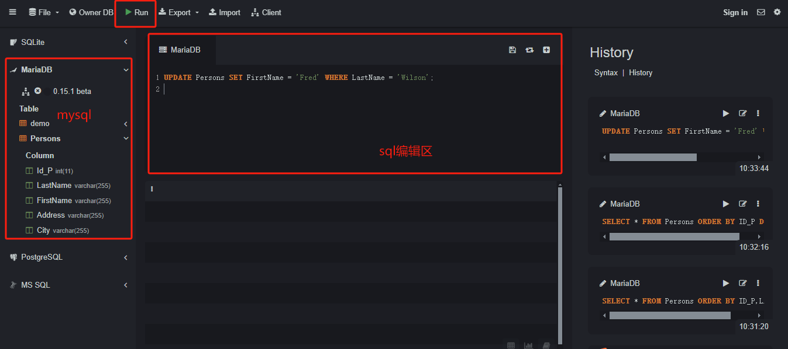

### 入门导读

为了方便大家学习SQL，这边提供了一个SQL在线环境，免安装(很多同学在第一步安装SQL的时候就劝退了)，因此推荐给大家。

**本课程所有内容相关的SQL都可以使用 SQL在线环境 进行运行和实。**

**1. SQL在线环境**

https://sqliteonline.com/

* 注：选择 MariaDB (MySQL分支版本)，和 MySQL 语法类似，便于大家学习
- SQL编辑区：sql语句的编写
- run：执行SQL语句